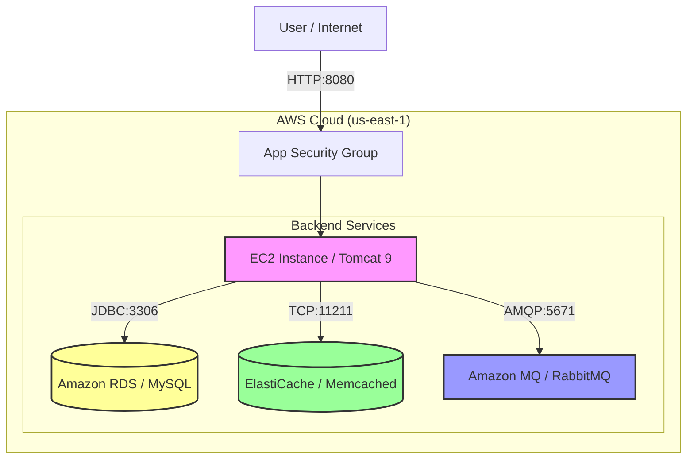

# vProfile: Multi-Tier Web Application Deployment on AWS with Terraform


This repository contains the Infrastructure as Code (IaC) scripts required to provision a production-ready environment on AWS for the vProfile Java application. The project leverages Terraform to automate the creation of network configurations, security groups, and backend services.

## Project Architecture

The architecture follows a standard multi-tier pattern deployed on AWS:

* **Load Balancing:** AWS Security Groups configured to simulate load balancer traffic distribution.
* **Application Layer:** EC2 Instance hosting Apache Tomcat 9 and the Java application artifact.
* **Backend Services:**
    * **Database:** Amazon RDS (MySQL) for persistent data storage.
    * **Caching:** Amazon ElastiCache (Memcached) for database caching.
    * **Message Broker:** Amazon MQ (RabbitMQ) for asynchronous messaging.

### Infrastructure Diagram


---
## Prerequisites

Ensure the following tools are installed and configured on your local machine before starting the deployment:

* **AWS CLI:** Configured with valid `Access Key ID` and `Secret Access Key` for an IAM user with appropriate permissions.
* **Terraform:** Version 1.0 or later.
* **Java Development Kit (JDK):** Version 11.
* **Apache Maven:** For building the Java artifact.
* **Git:** For version control and cloning the repository.
* **SSH Client:** OpenSSH or similar terminal client.

## Project Structure

This project uses modular Terraform configuration files to manage specific components of the infrastructure:

* **`provider.tf`**: Configures the AWS provider and target region.
* **`variables.tf`**: Defines input variables for resource customization (e.g., AMI IDs, instance types).
* **`terraform.tfvars`**: Stores sensitive variable values (e.g., database passwords). *Note: This file is excluded from version control.*
* **`backend.tf`**: Provisions backend services including Amazon RDS (MySQL), Amazon ElastiCache (Memcached), and Amazon MQ (RabbitMQ).
* **`secgrp.tf`**: Defines Security Groups to control network traffic between the Load Balancer, Application, and Backend layers.
* **`keypair.tf`**: Manages the SSH Key Pair for secure access to EC2 instances.
* **`instance.tf`**: Provisions the EC2 application server and configures the User Data script.
* **`userdata.sh`**: A shell script executed upon instance initialization to install dependencies (Tomcat 9, Java 11) and initialize the database schema.

## Deployment Guide

Follow these steps to deploy the application stack:

### 1. Infrastructure Provisioning
Initialize the Terraform working directory and apply the configuration to create the AWS resources.

```bash
terraform init
terraform validate
terraform apply --auto-approve

**Note:** The creation of the RDS instance may take approximately 10-15 minutes.

### 2. Application Configuration
After the infrastructure is provisioned, retrieve the endpoints for RDS, ElastiCache, and Amazon MQ from the AWS Console. Update the `src/main/resources/application.properties` file with the new hostnames and credentials.

### 3. Build Artifact
Compile the source code and package the application into a WAR file using Maven.

```bash
mvn install

Ensure the build completes with a `BUILD SUCCESS` message.

### 4. Deploy Artifact to Application Server
Transfer the generated artifact to the EC2 instance and deploy it to the Apache Tomcat server.

**Upload the WAR file:**
```bash
scp -i vprofile-key target/vprofile-v2.war ubuntu@<EC2_PUBLIC_IP>:/tmp/

**Deploy script (SSH into the server):**
```bash
ssh -i vprofile-key ubuntu@<EC2_PUBLIC_IP>

# Execute the following commands on the server:
sudo systemctl stop tomcat9
sudo rm -rf /var/lib/tomcat9/webapps/ROOT
sudo rm -rf /var/lib/tomcat9/webapps/ROOT.war
sudo cp /tmp/vprofile-v2.war /var/lib/tomcat9/webapps/ROOT.war
sudo systemctl start tomcat9

### 5. Validation
Open a web browser and navigate to the public IP of the EC2 instance on port 8080 to access the application.
```bash
http://<EC2_PUBLIC_IP>:8080/login

---
# Clean Up
* To prevent incurring unnecessary costs, destroy all provisioned resources once testing is complete.
* Open a web browser and navigate to the public IP of the EC2 instance on port 8080 to access the application.
```bash
terraform destroy --auto-approve

----
